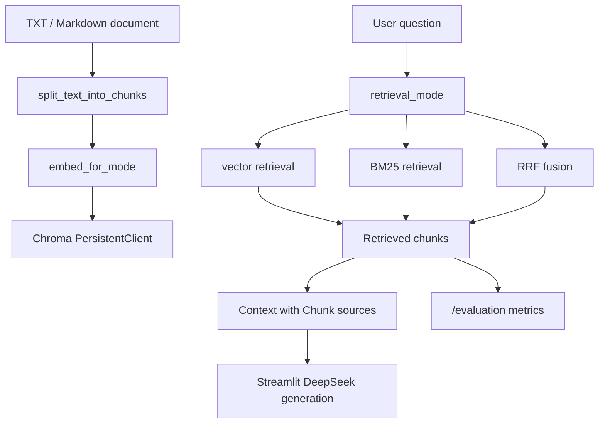

# DocuAsk Architecture

本文档记录 DocuAsk 当前已经实现并验证的架构，不包含未完成能力。

## 当前定位

DocuAsk 是一个本地文档 RAG 问答系统原型，已经从早期 Streamlit 单页面逐步升级为：

```text
Streamlit UI + FastAPI backend + reusable RAG services + Chroma persistent storage + retrieval evaluation
```

当前重点解决三个问题：

- 本地文档问答需要来源可追溯。
- 检索质量需要可量化评估。
- RAG 核心逻辑需要从页面中拆出，便于复用和测试。

## 模块结构

```text
04_成果输出/rag-qa-system/
  app.py
  API.md
  ARCHITECTURE.md
  backend/
    app.py
    README.md
    services/
      chunking.py
      embeddings.py
      retrieval.py
      bm25.py
      rrf.py
      evaluation.py
    storage/
      chroma_db_v2/       # local ignored runtime data
  tests/
    test_backend_api.py
    test_retrieval_metrics.py
```

## 数据流



说明：

- `vector` 使用 Chroma cosine distance。
- `bm25` 使用本地轻量 BM25 关键词检索。
- `rrf` 融合 vector ranking 和 BM25 ranking。
- Streamlit 页面当前负责用户交互和 DeepSeek 生成。
- FastAPI 后端当前负责文档入库、检索问答和检索评测。

## Service 边界

| Service | 职责 |
|---|---|
| `chunking.py` | 文档切分，优先按 Markdown `##` 标题切分，否则使用固定长度和 overlap |
| `embeddings.py` | 管理 Teaching keyword embedding 和 BGE Chinese embedding |
| `retrieval.py` | 管理 Chroma 持久化、collection 命名、向量检索和上下文格式化 |
| `bm25.py` | 提供关键词检索 baseline |
| `rrf.py` | 融合向量检索和 BM25 排名 |
| `evaluation.py` | 固定 10 题检索评测，计算 Top-1 hit 和 Top-k recall |

## 接口边界

| Endpoint | 当前职责 |
|---|---|
| `GET /health` | 后端健康检查 |
| `POST /documents` | 文档切分、embedding、写入 Chroma |
| `POST /qa` | 对已入库 collection 执行 Top-k 检索 |
| `POST /evaluation` | 用固定问题集评估检索模式 |

## 检索模式

| Mode | 适合场景 | 当前项目作用 |
|---|---|---|
| `vector` | 语义相似问题 | 原始向量检索 baseline |
| `bm25` | 关键词、专有名词、配置项问题 | 关键词检索 baseline |
| `rrf` | 需要融合语义和关键词排序 | 混合检索对比方案 |

Day49 固定评测结果：

```text
vector Top-1: 0.6, Top-k: 1.0
bm25  Top-1: 0.8, Top-k: 1.0
rrf   Top-1: 0.9, Top-k: 1.0
```

这个结果只能说明当前 FAQ 文档和 10 个固定问题下的表现。

## 持久化策略

Chroma 当前使用：

```text
backend/storage/chroma_db_v2/
```

collection 名称由三部分组成：

```text
embedding mode prefix + schema version + document hash
```

示例：

```text
uploaded_document_chunks_keyword_v3_xxxxxxxxxxxx
uploaded_document_chunks_bge_v3_xxxxxxxxxxxx
```

这样做的原因：

- 不同 embedding 维度不能混用同一个 collection。
- schema version 可以避开历史实验数据造成的索引冲突。
- document hash 可以让同一份文档复用已有 collection。

## 自动化测试

当前测试目标不是测试 DeepSeek 生成，而是稳定验证本地检索链路：

```text
文档入库 -> collection 查询 -> 检索模式切换 -> 固定问题评测 -> 错误分支
```

原因：

- LLM API 依赖网络、额度和外部服务状态。
- 检索链路是 RAG 系统可控且必须稳定的核心。
- 自动化测试应该优先覆盖本地可重复验证的行为。

## 当前限制

当前仍不能夸大为：

- 生产级多用户系统。
- 支持 PDF / Word 等复杂文档解析。
- 支持权限管理或多租户知识库。
- 大规模评测或压测完成。
- 已接入 rerank 模型。
- 后端已经生成最终 LLM answer。

更准确的当前表述：

```text
DocuAsk 已完成本地文档上传、切分、向量入库、三种检索模式、来源上下文展示和固定问题检索评测。
```

## 下一步

建议下一阶段优先做：

1. 在 FastAPI 中增加可选 LLM 生成参数或独立 answer endpoint。
2. 支持上传文件接口，而不是只接收 `text` 字段。
3. 扩展评测集，从 10 题小样本升级为更真实的多文档测试。
4. 再评估是否引入 rerank 或 Docker Compose。
