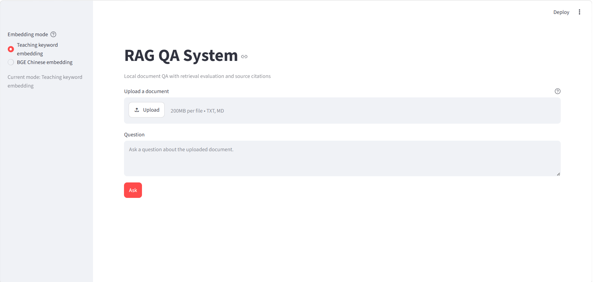
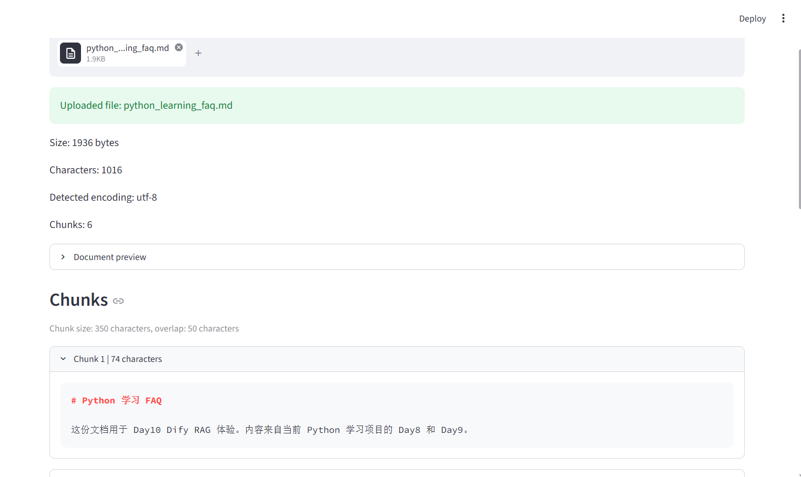
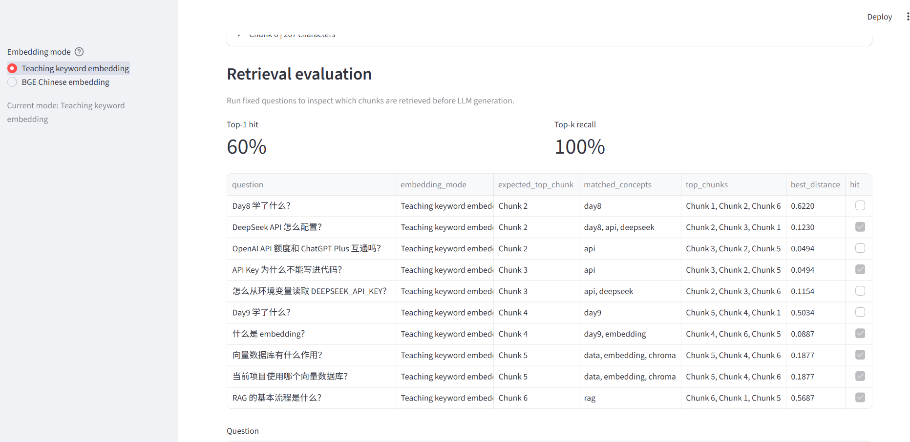
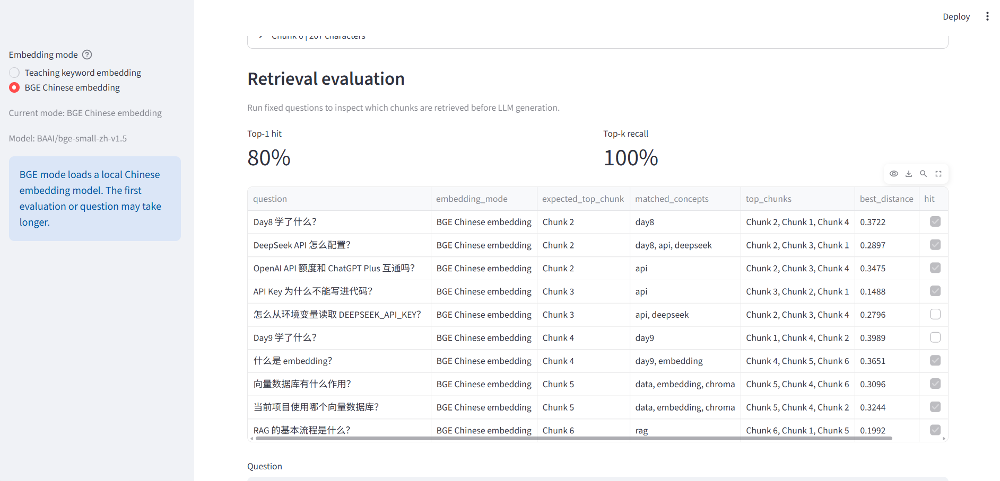
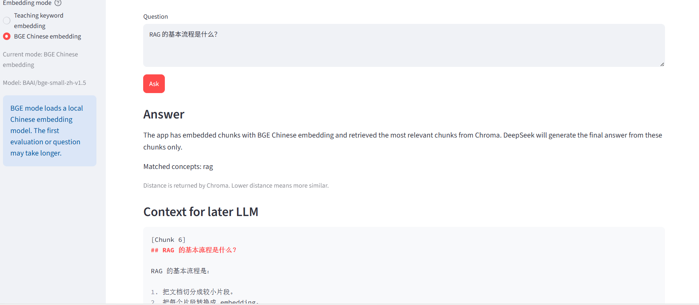
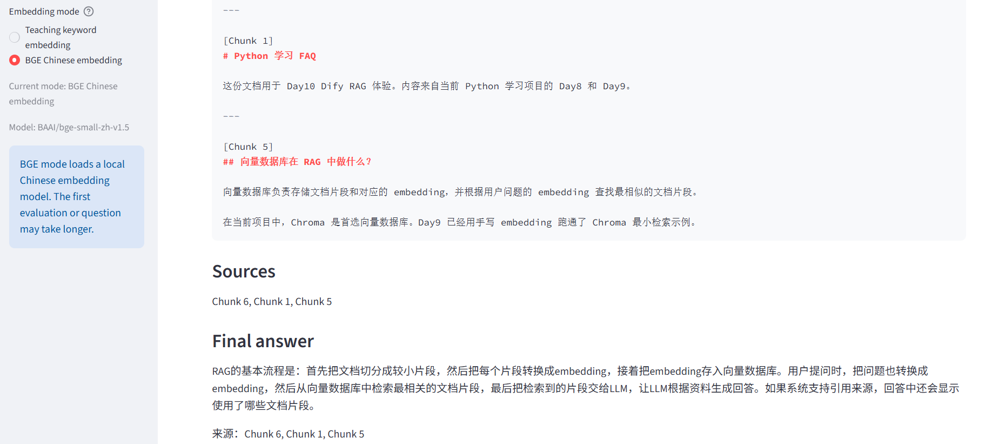

# RAG QA System

RAG QA System 是一个本地文档问答原型，用于学习和验证 RAG 的核心链路：

```text
文档上传 -> 文档读取 -> 文档切分 -> embedding -> 向量检索 -> 上下文组织 -> LLM 回答 -> 来源引用
```

当前版本以 Streamlit 作为页面入口，Chroma 作为向量数据库，DeepSeek 作为 OpenAI-compatible LLM API。

## 展示材料

- 项目展示说明：`PROJECT_BRIEF.md`
- 截图清单：`SCREENSHOT_CHECKLIST.md`
- 页面截图：`screenshots/`

## Screenshots

### Upload and Question



### Chunks



### Retrieval Metrics



### BGE Metrics



### Answer Context



### Final Answer and Sources



## 功能

- 上传 TXT 或 Markdown 文档。
- 读取上传文档内容并显示预览。
- 优先按 Markdown `##` 标题切分文档。
- 对普通文本使用固定长度切分。
- 支持教学版关键词 embedding 和 BGE 中文 embedding 双模式。
- 使用 Chroma cosine 距离检索 Top 3 chunks。
- 展示问题命中的概念维度。
- 展示检索上下文和来源引用。
- 调用 DeepSeek 基于检索上下文生成最终回答。
- 使用 10 个固定测试问题观察检索质量。
- 显示 expected top chunk、Top-1 hit、Top-k recall 和检索明细。

## 技术栈

- Python
- Streamlit
- Chroma
- Sentence Transformers
- OpenAI Python SDK
- DeepSeek API

## 运行方式

在仓库根目录运行：

```powershell
python -m streamlit run "04_成果输出/rag-qa-system/app.py"
```

打开：

```text
http://localhost:8501
```

## DeepSeek API Key

生成回答需要在启动 Streamlit 的同一个 PowerShell 中设置环境变量：

```powershell
$env:DEEPSEEK_API_KEY="your_api_key"
python -m streamlit run "04_成果输出/rag-qa-system/app.py"
```

注意：

- 不要把 API Key 写进代码。
- 不要把 API Key 提交到 GitHub。
- 如果页面提示 key 未设置，先确认启动 Streamlit 的当前终端能读到该环境变量。

检查命令：

```powershell
python -c "import os; print('set' if os.environ.get('DEEPSEEK_API_KEY') else 'missing')"
```

## 测试文档

推荐使用：

```text
02_资料与素材/day10_dify_knowledge/python_learning_faq.md
```

可测试问题：

```text
RAG 的基本流程是什么？
API Key 为什么不能写进代码？
什么是 embedding？
向量数据库有什么作用？
DeepSeek API 怎么配置？
```

## 检索评测

Day21 发现：不同问题基本返回同一组 chunks，说明检索区分能力不足。

Day22 优化后：不同问题已经能命中不同的 Top chunk。

```text
RAG 的基本流程是什么？        -> Chunk 6
API Key 为什么不能写进代码？  -> Chunk 3
什么是 embedding？            -> Chunk 4
向量数据库有什么作用？        -> Chunk 5
DeepSeek API 怎么配置？       -> Chunk 2
```

详细记录见：

```text
05_复盘与沉淀/day23_retrieval_evaluation_record.md
05_复盘与沉淀/day31_evaluation_review.md
05_复盘与沉淀/day33_app_metric_display.md
```

## Embedding 模式

当前支持两种模式：

```text
Teaching keyword embedding
BGE Chinese embedding
```

教学版关键词 embedding 适合理解向量检索原理，速度快、可解释。

BGE 中文 embedding 使用 `BAAI/bge-small-zh-v1.5`，适合验证真实中文语义检索效果。首次运行可能需要加载本地模型。

当前 FAQ 的评测结果：

```text
Teaching keyword embedding: Top-1 60%, Top-k 100%
BGE Chinese embedding: Top-1 80%, Top-k 100%
```

## 当前限制

- 暂不支持 PDF 解析。
- Chroma 当前使用临时 collection，没有持久化知识库。
- BGE 模型首次加载需要等待。
- 当前评测重点是 top-1 hit 和 top-k recall，还没有引入 rerank。
- BGE 首次加载会比教学版关键词 embedding 慢。

## 下一步

- 补充页面截图。
- 评估是否需要 rerank。
- 继续扩展测试文档和问题集。
