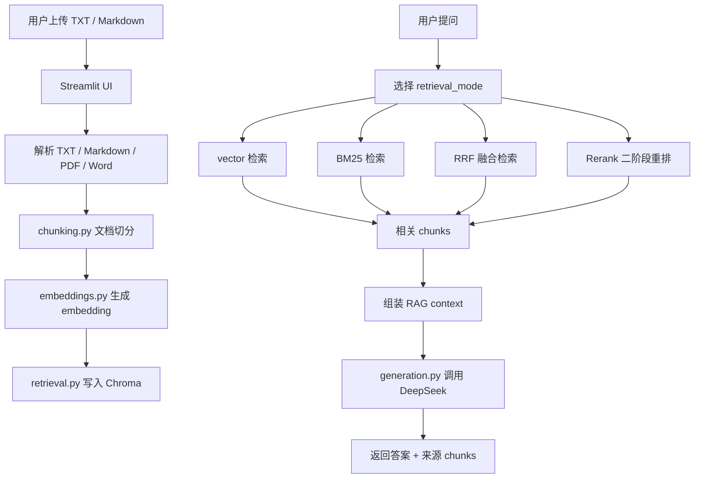

# DocuAsk 项目详细介绍

本文档面向没有参与过项目的人，目标是完整解释 DocuAsk 是什么、为什么要做、用了哪些技术、系统如何工作、项目是如何搭建起来的，以及当前能力边界在哪里。

## 1. 项目一句话介绍

DocuAsk 是一个本地文档 RAG 问答系统。用户上传 `.txt`、`.md`、`.pdf` 或 `.docx` 文档后，系统会把文档解析并切分成片段，转换成向量并写入 Chroma 向量数据库；用户提问时，系统先从本地文档中检索相关片段，可选择 rerank 做二阶段重排，再把片段交给大模型生成回答，并返回答案来源。

核心链路可以概括为：

```text
文档上传 -> 文本读取 -> 文档切分 -> embedding -> Chroma 入库 -> 检索召回 -> 上下文组装 -> LLM 生成 -> 来源引用
```

这个项目重点不是做一个复杂的在线平台，而是把 RAG 系统中最关键、最容易被追问的环节跑通，并且让检索效果可以被评测。

## 2. 项目要解决的问题

普通大模型直接回答问题时，主要依赖模型训练时已经学到的知识。如果问题涉及本地资料、私有文档、课程笔记、接口说明或项目文档，模型可能不知道真实内容，容易出现以下问题：

- 回答和本地资料不一致。
- 没有引用来源，用户无法判断依据。
- 模型不知道答案时仍然可能编造。
- 文档内容更新后，模型不能自动知道新内容。

DocuAsk 使用 RAG 思路解决这个问题：回答前先查资料，再基于资料回答。

更具体地说：

- 文档内容保存在本地。
- 用户问题不会直接交给 LLM 盲答。
- 系统会先检索最相关的文档片段。
- LLM 只能根据检索到的上下文生成答案。
- 回答中会保留来源 chunk，方便用户核对。

## 3. 使用场景

当前项目适合以下本地知识问答场景：

- 针对 Markdown FAQ 文档提问。
- 针对项目说明文档提问。
- 针对接口说明、学习笔记、技术资料做问答。
- 验证不同检索策略的召回效果。
- 演示一个可运行、可测试、可解释的 RAG 最小系统。

当前不适合直接包装成生产系统，因为它还没有多用户权限、扫描版 PDF OCR、线上部署运维、权限隔离、生产级日志监控和大规模压测。

## 4. 技术栈

| 技术 | 在项目中的作用 |
|---|---|
| Python | 项目主语言 |
| Streamlit | 前端页面，负责上传文档、输入问题、展示结果 |
| FastAPI | 后端接口，提供文档入库、检索问答、生成回答、评测接口 |
| Chroma | 本地向量数据库，存储 chunk 和 embedding |
| Sentence Transformers | 加载 BGE 中文 embedding 模型 |
| BAAI/bge-small-zh-v1.5 | 中文 embedding 模型 |
| OpenAI Python SDK | 以 OpenAI-compatible API 方式调用 DeepSeek |
| DeepSeek API | LLM 生成回答 |
| BM25 | 关键词检索 baseline |
| RRF | 融合向量检索和 BM25 排序 |
| pytest | 自动化测试 |
| python-multipart | 支持 FastAPI 文件上传 |
| pypdf | 提取 PDF 文本 |
| python-docx | 提取 Word 文档文本 |
| Docker / Docker Compose | 提供可复现本地运行环境 |

## 5. 项目目录结构

当前 GitHub 仓库已经整理成项目仓库结构：

```text
docuask/
  README.md
  PROJECT_BRIEF.md
  ARCHITECTURE.md
  API.md
  requirements.txt
  pytest.ini
  app.py
  backend/
    README.md
    app.py
    services/
      chunking.py
      embeddings.py
      retrieval.py
      bm25.py
      rrf.py
      rerank.py
      document_parser.py
      errors.py
      logging_config.py
      generation.py
      evaluation.py
  examples/
    rag_faq.md
    docuask_backend_faq.md
  tests/
    conftest.py
    test_backend_api.py
    test_retrieval_metrics.py
  Dockerfile
  docker-compose.yml
```

几个关键文件的含义：

| 文件或目录 | 作用 |
|---|---|
| `app.py` | Streamlit 页面入口 |
| `backend/app.py` | FastAPI 后端入口 |
| `backend/services/` | RAG 核心业务逻辑 |
| `examples/` | 示例文档和评测文档 |
| `tests/` | 自动化测试 |
| `README.md` | 项目首页 |
| `ARCHITECTURE.md` | 架构说明 |
| `API.md` | 后端接口说明 |
| `PROJECT_BRIEF.md` | 项目展示说明 |

## 6. 整体架构

DocuAsk 当前是一个本地单机项目，由两部分组成：

- Streamlit UI：负责用户交互。
- FastAPI backend：负责可复用的接口和后端能力。

底层 RAG 能力被拆分到多个 service 模块中，方便复用和测试。



## 7. 核心知识点

### 7.1 RAG

RAG 是 Retrieval-Augmented Generation，也就是检索增强生成。

它的核心思想是：

```text
先检索资料，再让模型根据资料回答。
```

在 DocuAsk 中，RAG 被拆成两个阶段：

1. 入库阶段：上传文档、切分文档、生成 embedding、写入 Chroma。
2. 问答阶段：用户提问、检索相关 chunks、组装上下文、调用 LLM 生成答案。

### 7.2 Chunking

Chunking 是文档切分。它解决的问题是：一篇完整文档可能很长，如果直接整篇送入检索系统，召回结果会过粗；如果切得太碎，又可能丢失上下文。

项目中的实现位于：

```text
backend/services/chunking.py
```

当前策略：

- 优先按 Markdown 二级标题 `##` 切分。
- 如果文档没有多个 Markdown section，则按固定字符长度切分。
- 固定长度切分时支持 overlap，避免边界处信息被截断。

示例：

```text
chunk_size = 350
chunk_overlap = 50
```

这表示每个 chunk 最多约 350 个字符，相邻 chunk 之间保留 50 个字符重叠。

### 7.3 Embedding

Embedding 是把文本转换成数字向量。向量化之后，系统就可以用数学方式比较两段文本是否相似。

项目支持两种 embedding 模式：

| 模式 | 作用 |
|---|---|
| Teaching keyword embedding | 教学版关键词向量，便于理解原理 |
| BGE Chinese embedding | 真实中文语义向量，用于更接近实际场景的检索 |

相关实现位于：

```text
backend/services/embeddings.py
```

教学版关键词 embedding 的特点：

- 通过关键词命中生成向量。
- 可解释性强。
- 速度快。
- 不是真实语义 embedding。

BGE 中文 embedding 的特点：

- 使用 `BAAI/bge-small-zh-v1.5`。
- 语义表达能力更强。
- 首次加载模型需要一定时间。
- 向量维度和教学版不同，不能混入同一个 Chroma collection。

### 7.4 Vector Search

向量检索的核心是：把问题和文档片段都转换成向量，然后比较相似度。

在 DocuAsk 中：

- 文档 chunk 会被转换成 embedding。
- 用户问题也会被转换成 embedding。
- Chroma 使用 cosine distance 返回最相似的 chunks。

返回结果中的 `distance` 越小，表示越相似。

### 7.5 Chroma

Chroma 是项目使用的本地向量数据库。

它负责：

- 保存 chunk 文本。
- 保存 chunk 对应的 embedding。
- 保存 metadata，例如 `chunk_index`。
- 根据 query embedding 检索相似 chunk。

相关实现位于：

```text
backend/services/retrieval.py
```

项目使用 Chroma `PersistentClient`，数据存储在：

```text
backend/storage/chroma_db_v2/
```

该目录属于本地运行数据，不提交到 GitHub。

### 7.5.1 PDF / Word 文档解析

项目中的文件解析实现位于：

```text
backend/services/document_parser.py
```

当前支持：

- `.txt`
- `.md`
- `.pdf`
- `.docx`

其中：

- TXT / Markdown 会按 `utf-8`、`gbk` 顺序尝试解码。
- PDF 使用 `pypdf` 提取页面文本。
- Word 使用 `python-docx` 提取段落文本。

需要注意：当前 PDF 解析只支持可提取文本的 PDF。如果 PDF 是扫描图片，里面没有文本层，则需要 OCR，这部分尚未实现。

### 7.6 Collection 命名策略

DocuAsk 没有把所有文档都写进同一个 collection，而是通过规则生成 collection name：

```text
embedding mode prefix + schema version + document hash
```

示例：

```text
uploaded_document_chunks_keyword_v3_xxxxxxxxxxxx
uploaded_document_chunks_bge_v3_xxxxxxxxxxxx
```

这样做有三个原因：

- 不同 embedding 模式的向量维度不同，不能混用。
- schema version 可以隔离历史索引结构。
- 文档 hash 可以让同一份文档复用已有 collection。

### 7.7 BM25

BM25 是一种传统关键词检索算法。

它更适合：

- 关键词明确的问题。
- 配置项、接口名、环境变量这类精确匹配问题。
- 缩写、专有名词较多的文档。

项目中的 BM25 实现位于：

```text
backend/services/bm25.py
```

BM25 和向量检索的区别：

| 检索方式 | 更关注什么 |
|---|---|
| vector | 语义相似 |
| BM25 | 关键词匹配 |

### 7.8 RRF

RRF 是 Reciprocal Rank Fusion，用来融合多个检索器的排序结果。

项目中，RRF 用于融合：

- vector 检索排序。
- BM25 检索排序。

它不是直接把两个分数相加，因为 vector distance 和 BM25 score 的尺度不同，直接相加不稳定。

RRF 更关注“排名位置”，常见思路是：

```text
score += 1 / (k + rank)
```

如果一个 chunk 在多个检索器中都排得靠前，它的最终 RRF 分数就会更高。

相关实现位于：

```text
backend/services/rrf.py
```

### 7.8.1 Rerank

Rerank 是二阶段排序。

项目中的实现位于：

```text
backend/services/rerank.py
```

当前 `rerank` 模式的流程是：

1. 先通过 RRF 获取候选 chunks。
2. 再根据问题和 chunk 的关键词重合、标题命中、原始候选排名等信号计算 `rerank_score`。
3. 按 `rerank_score` 重新排序。

它的目标是：在正确 chunk 已经进入候选集的情况下，提高 Top-1 排序质量。

当前 rerank 是本地轻量重排，不是外部 cross-encoder rerank 模型。

### 7.9 LLM Answer Generation

项目使用 DeepSeek 作为 OpenAI-compatible LLM API。

相关实现位于：

```text
backend/services/generation.py
```

关键点：

- 使用 OpenAI Python SDK。
- 设置 `base_url="https://api.deepseek.com"`。
- 从环境变量 `DEEPSEEK_API_KEY` 读取密钥。
- 不把 API Key 写进代码。
- prompt 要求模型只根据给定资料回答。
- 回答末尾必须带来源。

Prompt 核心约束是：

```text
请只根据下面的资料回答问题。
如果资料中没有相关信息，就回答：资料中没有找到相关信息。
回答最后必须写一行来源。
```

### 7.10 FastAPI

FastAPI 负责把 RAG 能力包装成接口。

当前接口包括：

| Endpoint | 作用 |
|---|---|
| `GET /health` | 健康检查 |
| `POST /documents` | 文本入库 |
| `POST /documents/upload` | 文件上传入库 |
| `POST /qa` | 检索问答，返回 chunks 和 context |
| `POST /answer` | 检索后调用 LLM 生成回答 |
| `POST /evaluation` | 检索评测 |

接口错误会返回结构化错误码，相关实现位于：

```text
backend/services/errors.py
```

例如：

```json
{
  "detail": {
    "code": "unsupported_file_type",
    "message": "unsupported file type"
  }
}
```

这样比只返回字符串更利于前端判断错误类型。

后端入口位于：

```text
backend/app.py
```

### 7.11 Streamlit

Streamlit 是项目的页面入口，位于：

```text
app.py
```

页面负责：

- 上传文件。
- 选择 embedding 模式。
- 显示文档预览。
- 显示 chunks。
- 输入问题。
- 展示检索结果。
- 展示 context。
- 展示最终 answer 和 sources。
- 展示 retrieval evaluation 表格。

### 7.12 pytest

pytest 用于自动化验证项目核心行为。

测试位于：

```text
tests/
```

当前测试覆盖：

- 文档入库。
- Markdown 文件上传。
- Word 文件上传。
- 无效 PDF 解析失败。
- 不支持文件类型的错误处理。
- vector / BM25 / RRF / rerank 检索。
- `/answer` 缺少 API Key 的异常分支。
- `/evaluation` 固定问题评测。
- failure cases 记录。
- 自定义 evaluation cases。
- collection 不存在时返回 404。
- retrieval mode 不合法时返回 400。

自动化测试不直接调用真实 LLM API，因为真实 API 依赖网络、API Key、额度和模型输出稳定性，不适合作为稳定单元测试的一部分。

## 8. 数据流详解

### 8.1 文档入库流程

用户上传文档后，系统执行以下步骤：

1. 读取上传文件的 bytes。
2. 尝试用 `utf-8` 解码。
3. 如果失败，尝试 `gbk`。
4. 如果还失败，用 `utf-8 with replacement` 兜底。
5. 调用 `split_text_into_chunks` 切分文本。
6. 根据 embedding mode 对每个 chunk 生成 embedding。
7. 根据文档内容 hash 生成 collection name。
8. 调用 Chroma `upsert` 写入：
   - chunk id
   - chunk 文本
   - embedding
   - metadata

### 8.2 检索问答流程

用户提问后，系统执行以下步骤：

1. 读取用户问题。
2. 根据当前 embedding mode 生成 query embedding。
3. 根据 `retrieval_mode` 选择检索方式：
   - `vector`
   - `bm25`
   - `rrf`
4. 返回 top-k chunks。
5. 用 `format_retrieved_context` 组装上下文。
6. 如果调用 `/qa`，返回检索结果和 context。
7. 如果调用 `/answer`，继续把 context 交给 DeepSeek 生成 answer。

### 8.3 生成回答流程

生成回答时，系统会把问题、检索上下文和来源信息拼进 prompt。

LLM 接收到的不是原始文档全集，而是检索出来的 chunk context。

这样做的目的：

- 降低上下文长度。
- 让模型集中在相关资料上。
- 让答案能追溯到 chunk。
- 降低模型脱离资料编造的概率。

## 9. 检索评测设计

RAG 项目不能只看“页面能不能回答”，还要看检索是否正确。

DocuAsk 使用两个指标：

| 指标 | 含义 |
|---|---|
| Top-1 hit | 第一名是否为期望 chunk |
| Top-k recall | 期望 chunk 是否出现在前 k 个结果中 |

为什么要区分这两个指标：

- Top-1 hit 反映排序质量。
- Top-k recall 反映是否召回到了正确资料。
- 如果 Top-k recall 高但 Top-1 hit 低，说明资料找到了，但排序还可以优化。

当前 FAQ 样例文档的验证结果：

| Retrieval mode | Top-1 hit | Top-k recall |
|---|---:|---:|
| vector | 0.7 | 1.0 |
| BM25 | 0.8 | 0.9 |
| RRF | 0.8 | 0.9 |
| rerank | 0.867 | 1.0 |

注意：这个结果只说明当前小型 FAQ 样例和固定问题集下的表现，不能代表所有文档场景。当前 rerank 在该样例中把 Top-1 hit 提升到 86.7%，同时保持 100% Top-k recall。

## 10. 项目搭建过程

项目搭建可以理解为从一个最小 RAG 原型逐步工程化的过程。

### 10.1 阶段一：跑通最小链路

第一步先验证 RAG 是否能跑通：

```text
上传文档 -> 切分文档 -> 用户提问 -> 检索 chunk -> 显示来源
```

这个阶段重点不是架构，而是证明核心链路可行。

主要产物：

- Streamlit 页面。
- 文档上传。
- 文档预览。
- chunk 展示。
- 基础向量检索。

### 10.2 阶段二：引入 embedding 和 Chroma

最开始使用教学版关键词 embedding，目的是让向量检索原理可解释。

之后加入 BGE 中文 embedding，让项目具备真实语义检索能力。

再引入 Chroma，把 chunk 和 embedding 存入向量数据库。

这个阶段解决的问题：

- 文本如何转向量。
- 文档片段如何持久化。
- 用户问题如何找到相关 chunk。

### 10.3 阶段三：加入检索评测

仅凭页面展示很难判断检索质量，所以项目加入固定问题集评测。

评测流程：

1. 准备样例文档。
2. 人工指定每个问题期望命中的 chunk。
3. 系统执行检索。
4. 记录 top chunks。
5. 计算 Top-1 hit 和 Top-k recall。

这个阶段让项目从“能跑”升级为“能评估”。

### 10.4 阶段四：拆分后端模块

早期 RAG 逻辑集中在 Streamlit 页面中，不利于测试和复用。

后续把逻辑拆分为：

```text
chunking
embeddings
retrieval
generation
evaluation
bm25
rrf
rerank
document_parser
errors
logging_config
```

拆分后的好处：

- 每个模块职责清晰。
- 更容易写测试。
- FastAPI 和 Streamlit 可以复用同一套逻辑。
- 后续扩展文档解析、检索排序、Docker 部署和接口错误处理更容易。

### 10.5 阶段五：加入 FastAPI

FastAPI 的作用是把核心能力变成可调用接口。

这样项目不再只是一个页面 demo，而是具备后端接口边界：

```text
/documents
/documents/upload
/qa
/answer
/evaluation
```

这个阶段提升了项目的工程属性。

### 10.6 阶段六：加入 BM25 和 RRF

单一向量检索不一定适合所有问题。

例如：

- 环境变量名。
- API Key。
- 接口路径。
- 模型名。

这类问题通常关键词匹配很重要。

因此项目加入：

- BM25：关键词检索 baseline。
- RRF：融合 vector 和 BM25 排序。

这样可以对比不同检索方式的效果。

### 10.7 阶段七：加入自动化测试

最后通过 pytest 固化核心能力。

测试重点不是测试真实 LLM 输出，而是测试本地可控链路：

```text
文档入库 -> 检索 -> 评测 -> 错误处理
```

这样每次修改后都能确认核心功能没有被破坏。

### 10.8 阶段八：项目后续升级

后续升级补充了五类能力：

1. PDF / Word 文档解析。
2. `rerank` 二阶段重排。
3. 15 题 evaluation cases 和 failure cases 记录。
4. Docker / Docker Compose 可复现部署。
5. 简单日志和结构化错误码。

这些能力的重点是让项目更接近真实 RAG 工程，而不是只停留在页面 demo。

## 11. 如何运行项目

### 11.1 安装依赖

在仓库根目录运行：

```powershell
python -m pip install -r requirements.txt
```

### 11.2 启动 Streamlit 页面

```powershell
python -m streamlit run app.py
```

打开：

```text
http://localhost:8501
```

### 11.3 设置 DeepSeek API Key

如果需要生成最终回答，需要在启动 Streamlit 的同一个 PowerShell 中设置：

```powershell
$env:DEEPSEEK_API_KEY="your_api_key"
python -m streamlit run app.py
```

检查环境变量是否存在：

```powershell
python -c "import os; print('set' if os.environ.get('DEEPSEEK_API_KEY') else 'missing')"
```

### 11.4 启动 FastAPI 后端

```powershell
python -m uvicorn backend.app:app --app-dir "." --host 127.0.0.1 --port 8000
```

健康检查：

```text
http://127.0.0.1:8000/health
```

### 11.5 运行测试

```powershell
python -m pytest -q
```

当前验证结果：

```text
18 passed, 1 warning
```

其中 warning 来自 FastAPI/TestClient 依赖的弃用提示，不影响当前测试结果。

### 11.6 Docker 运行

```powershell
docker compose up --build
```

如果需要 LLM 生成回答，可以在本机设置 `DEEPSEEK_API_KEY` 后再启动 Docker Compose。

## 12. 当前能力边界

已经实现：

- `.txt` / `.md` 文件上传。
- `.pdf` / `.docx` 文件上传。
- 文档切分。
- 教学版关键词 embedding。
- BGE 中文 embedding。
- Chroma 本地持久化。
- vector / BM25 / RRF / rerank 四种检索模式。
- rerank 二阶段重排。
- 检索上下文展示。
- DeepSeek 生成回答。
- 来源 chunk 引用。
- FastAPI 后端接口。
- 固定问题评测。
- 自定义 evaluation cases。
- failure cases 记录。
- 结构化错误码。
- 基础日志。
- Docker Compose 运行配置。
- pytest 自动化测试。

尚未实现：

- 扫描版 PDF OCR。
- 外部 cross-encoder rerank 模型。
- 多用户权限。
- 多租户知识库隔离。
- 大规模 benchmark。
- 线上压测。
- 生产级日志和监控。

## 13. 项目价值

DocuAsk 的价值主要体现在三个方面。

第一，它完整跑通了本地 RAG 问答链路，不只是调用一个 LLM API。

第二，它把检索效果量化为 Top-1 hit 和 Top-k recall，能解释检索质量，而不是只看页面输出。

第三，它把 RAG 逻辑拆成模块并提供 FastAPI 接口和 pytest 测试，使项目具备可复用、可验证、可继续扩展的基础。

## 14. 可以继续优化的方向

后续如果继续升级，建议按以下顺序：

1. 扩大评测集，记录失败案例。
2. 接入外部 cross-encoder rerank 模型。
3. 增加 OCR，支持扫描版 PDF。
4. 扩展 Docker Compose 到前后端分离部署。
5. 增强日志采集、错误追踪和运行监控。
6. 增加多文档管理能力。
7. 增加用户权限和知识库隔离。

优先级最高的是继续扩大评测集和评估外部 rerank 模型，因为 RAG 系统最核心的问题不是页面做得多复杂，而是能否稳定检索到正确资料。

## 15. 面试解释版本

如果要在面试中介绍这个项目，可以这样说：

```text
DocuAsk 是我实现的一个本地文档 RAG 问答系统。它支持上传 txt、Markdown、PDF 和 Word 文档，系统会先解析文本，再切分成 chunks，转换成 embedding 后写入 Chroma。用户提问时，系统可以用 vector、BM25、RRF 或 rerank 检索相关 chunks，再把检索上下文交给 DeepSeek 生成回答，并展示来源 chunk。

项目中我重点做了三件事：第一，跑通从文档上传到来源引用的完整 RAG 链路；第二，把 chunking、embedding、retrieval、generation、evaluation、rerank、document_parser 等逻辑拆成后端模块，并用 FastAPI 暴露接口；第三，用 Top-1 hit、Top-k recall 和 failure cases 对检索效果做小样本评测，并用 pytest 覆盖核心接口和异常分支。

当前它仍然是本地原型，不是生产级系统，还不支持 OCR、多用户权限和大规模压测。后续我会优先扩展真实评测集、评估外部 rerank 模型，并补充复杂文档解析能力。
```
